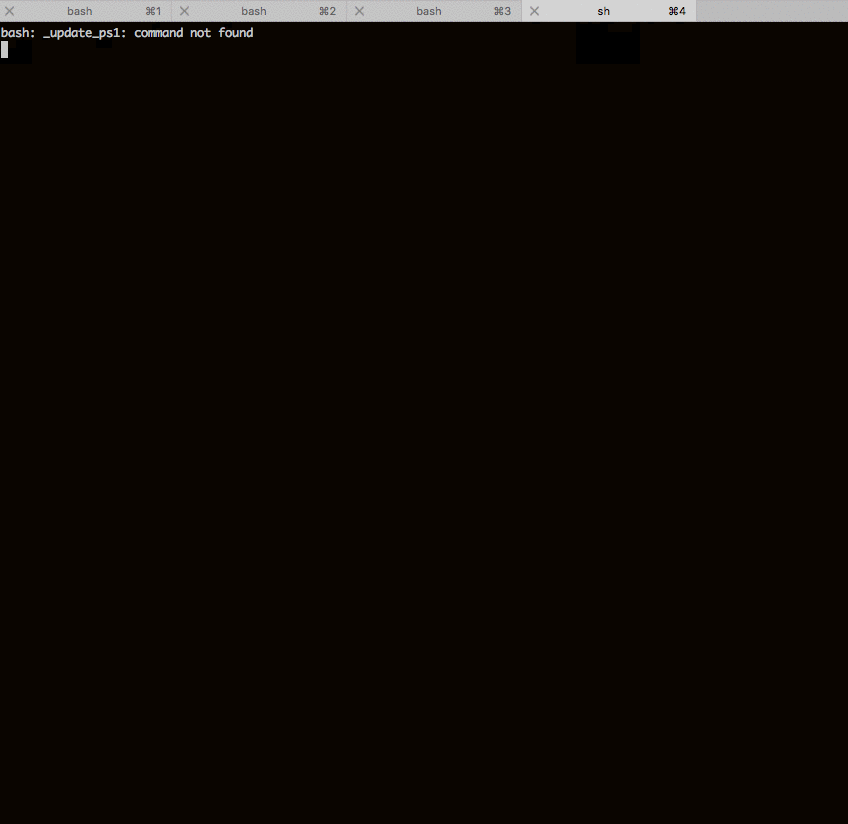

# cli-inspector

A library to help test CLI. Originally intended to test [inquirer.js](https://github.com/SBoudrias/Inquirer.js) driven CLIs.

- Should work for other CLI applications, but YMMV.
- Only tested on MacOSX. Should work on *nix.
- Windows reports and especially Pull-Requests much appreciated.

# Installation

    npm install cli-inspector

# Usage

```typescript
    const inspector = require('cli-inspector');
    inspector.run(
      cmd_line,     // command-line to spawn child process
      interactions, // array of Interactions (see below)
      options       // extends child_process.spawnOptions
    );
```

# Action
The gif below shows a build of cli-inspector, including tests, which use cli-inspector
to test an example inquirer.js pizza-ordering application.



# API documentation

## inspector.run()
`cli-inspector` exposes a single method - run(). The idea is to provide it an
array of in-sequence CLI interaction.

An example interactions array: [src/test/fixtures/inquirer/interactions.js](src/test/fixtures/inquirer/interactions.ts).

```typescript
/**
 * run an cli-test.
 * 1. spawn a child process with the cmd_line specified.
 * 2. Provide an array of individual interactions. See [tests](test/fixtures/inquirer/interactions.ts)
 *    for a working example. `npm run build` to see it in action.
 *    interactions.forEach( (interaction) => {
 *      - wait for the prompt on interaction.stdout (string/regexp)
 *      - pipe interaction.input to stdin
 *      - wait for interaction.stdout/interaction.stderr if specified.
 *      rinse and repeat
 * 3. Options provide control over the inspector and the child_process.
 *    The most important control provided by `cli-inspector` are
 *     - `delta`, the polling interval. Defaults to 1000
 *     - `timeout`, the time to wait in ms till
 * @export
 * @param {string} cmd_line
 * @param {Interaction[]} interactions
 * @param {Options} [options]
 */
 export async function run(
  cmd_line: string,
  interactions: Interaction[],
  options?: Options
);
```

## Interaction(s)

```typescript
export interface Interaction {
  /**
   * await prompt before processing this element
   *
   * @type {(string | RegExp)}
   */
  prompt: string | RegExp;
  /**
   * when prompt found, input is piped into stdin of child process.
   * If an array, each element is sent with the delta timeout
   *
   * @type {((string | RegExp)[] | (string | RegExp))}
   */
  input: (string | RegExp)[] | (string | RegExp);
  /**
   * (Optional) message to await on stdout of child process, after input
   *
   * @type {(string | RegExp)}
   */
  stdout?: string | RegExp;
  /**
   * (Optional) message to await on stderr of child process, after input
   *
   * @type {(string | RegExp)}
   */
  stderr?: string | RegExp;
  /**
   * optional timeout for this step.
   *
   * @type {(number | null)}
   * @default (value of options.timeout)
   */
  timeout?: number | null;

  /**
   * debug this step only. useful to find problems deep in an interaction chain.
   *
   * @type {boolean}
   * @default false
   */
  debugStep?: boolean;
}
```

## Options

```typescript
export interface Options extends SpawnOptions {
  /**
   * prints all child_process stdin/stdout/stderr to process stdout/stderr
   *
   * @type {boolean}
   * @default false
   */
  debug?: boolean;

  /**
   * Total timeout for each prompt-input-response sequence.
   * Specified in milliseconds
   * Can also be customized per interaction, but this sets the default value
   * for all interactions when not specified.
   *
   * @type {number}
   * @default 5000
   */
  timeout?: number;

  /**
   * delta time between polling intervals and between keyboard sequences.
   * Specified in milliseconds
   *
   * @type {number}
   * @default 1000
   */
  delta?: number;
  /**
   * Normally, the child process is killed on exit. This allows control.
   * Generally, this is not very useful except for interactive debugging.
   *
   * @type {boolean}
   * @default false
   */
  killOnExit?: boolean;
}
```

# Usage notes
CLIs have control sequences that make exact matching very cumbersome to create and maintain.
It's much more convenient to use RegExps with wildcards and keywords.

This works well, but a few cautions:

1. Prefer `[\s\S]*` to `.*` with regular expressions that match multi-line strings with terminal control characters.
2. Escape all regexp special characters. There are a surprising number of them in regular CLIs. The set you should watch for: `^?[]()-{}!,*.`
3. Understand the value of `debug` and `debugStep` provided in by `cli-inspector`. It'll allows you to speed up the iteration required to make workable interactions array.


# Develop

    git clone https://github.com/tufan-io/cli-inspector
    cd cli-inspector
    npm i
    npm run build

# How does it work?

- Spawns a child process with the supplied command line, under control of the cli-inspector.
- Pipes stdin, stdout and stderr appropriately.

```
    +---------------+
    | cli-inspector |                     +---------------+
    |               |       stdin         | child process |
    |               +---------------------->              |
    |               |       stdout        |               |
    |              <----------------------+               |
    |               |       stderr        |               |
    |              <----------------------+               |
    +---------------+                     +---------------+
```

- Iterates over the supplied interactions,
    await interaction.prompt (on stdout)
    send interaction.userInput (on stdin)
    await interaction.response (on stdout) or interaction.error (on stderr)
- kills child-process on completion.

There are multiple debug controls provided, please look at the code or ask questions!

## License
Apache 2.0


## Support
Bugs, PRs, comments, suggestions welcomed!